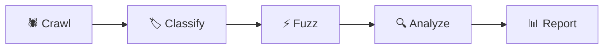
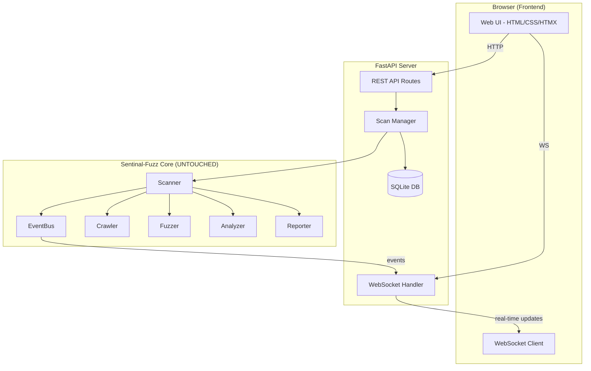
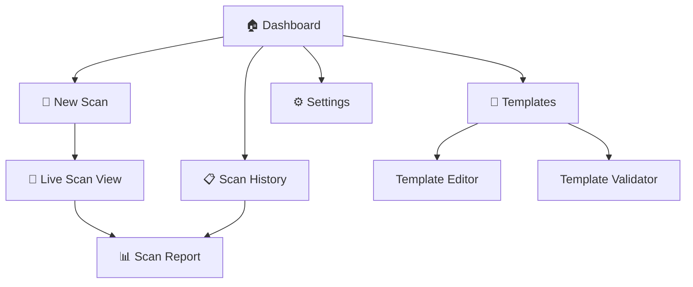

# Sentinal-Fuzz Web Interface — Full Implementation Plan

> Transform the existing CLI-only DAST scanner into a beginner-friendly, zero-cost, deployable web application — without modifying the core backend.

---

## 1. Background & Project Analysis

### What Sentinal-Fuzz Is Today
Sentinal-Fuzz is a **fully-featured CLI-based DAST scanner** written in Python 3.11+ with a modular 5-phase scanning pipeline:



| Component | Key Files | Responsibility |
|:--|:--|:--|
| **Core** | `scanner.py`, `config.py`, `models.py`, `event_bus.py` | Orchestration, config management, data models, real-time events |
| **Crawler** | `http_crawler.py`, `js_crawler.py`, `base.py` | BFS crawling, form extraction, tech fingerprinting, robots.txt |
| **Fuzzer** | `engine.py`, `template_loader.py`, `input_classifier.py`, `deduplicator.py` | Payload injection, matcher evaluation, false-positive filtering |
| **Detectors** | `headers.py`, `exposure.py`, `path_traversal.py`, `ssrf.py`, `ssti.py` | Passive + active vulnerability detection |
| **Analyzer** | `classifier.py`, `aggregator.py`, `prioritizer.py` | CVSS enrichment, CWE/OWASP mapping, risk scoring |
| **Reporter** | `html_reporter.py`, `json_reporter.py`, `sarif_reporter.py` | Multi-format report generation |
| **CLI** | `cli.py`, `cli_display.py`, `config_loader.py` | Typer-based CLI, Rich TUI, config merging |
| **Templates** | 9 YAML templates + payload files | XSS, SQLi, SSTI, SSRF, Path Traversal, Open Redirect, Headers, Exposure |

### Critical Architecture Strengths (We Must Leverage)
1. **EventBus** — `event_bus.py` emits `url_found`, `crawl_complete`, `finding`, `stage_changed`, `scan_complete` events. This is the **perfect hook** for WebSocket-based real-time updates.
2. **`ScanConfig.from_dict()`** — Accepts a plain dictionary, making it trivial to create configs from web form submissions.
3. **`ScanResult.to_dict()`** / `Finding.to_dict()`** — Full JSON serialization already exists.
4. **Plugin API** — `Scanner.set_crawler()`, `set_fuzzer()`, `add_reporter()` allow clean extension.
5. **Template system** — YAML-based, loadable, validatable — perfect for a web-based template editor.

---

## 2. Competitor Analysis & Inspiration

| Tool | What We Admire | What We Do Better |
|:--|:--|:--|
| **OWASP ZAP** | Comprehensive GUI, proxy mode, large community | ZAP is Java/Swing desktop — we provide a **modern web UI** accessible from any browser |
| **Nuclei** | Blazing fast, template-based scanning, massive community templates | Nuclei has **no built-in GUI** — we provide visual template management + live scan dashboards |
| **Burp Suite** | Industry gold standard, polished UX for manual testing | Burp is **paid/proprietary** — we are 100% free & open source |
| **DefectDojo** | Best-in-class vulnerability management dashboard | DefectDojo is a heavy Django app — ours is **lightweight, single-project focused** |
| **NucleiUI** | Web frontend for Nuclei scans, clean minimal design | We integrate scanning + results in **one unified experience** |

### Design Principles Borrowed
- From **ZAP**: Tabbed layout with Sites tree, Alerts panel, Request/Response viewer
- From **Nuclei**: Template marketplace/browser concept, clean severity badges
- From **DefectDojo**: Dashboard-first approach, severity donut charts, trend tracking
- From **Burp Suite**: Split-pane request/response viewer, professional color coding
- **Our unique angle**: Wizard-style "guided scan" for complete beginners

---

## 3. Technology Stack Decision

> [!IMPORTANT]
> **Zero-Cost Constraint**: Every tool chosen below is 100% free, open-source, and has no paid tier requirement.

### Backend (API Layer)

| Choice | Technology | Why This One |
|:--|:--|:--|
| **API Framework** | **FastAPI** (Python) | Same Python ecosystem as Sentinal-Fuzz. Native `async/await`, automatic OpenAPI docs, WebSocket support built-in. The **#1 most beginner-friendly** modern Python web framework. |
| **WebSocket** | **FastAPI WebSocket** | Real-time scan progress streaming using the existing `EventBus`. No external broker needed. |
| **Task Queue** | **asyncio background tasks** | Since Sentinal-Fuzz is already async, we run scans as background `asyncio.Task`s — no Celery/Redis needed for single-user mode. |
| **Database** | **SQLite via aiosqlite** | Already a project dependency. Stores scan history, settings. Zero setup, zero cost, file-based. |
| **Auth (optional)** | **Simple token/password hash** | For self-hosted mode. No OAuth complexity for beginners. |

### Frontend (Web UI)

| Choice | Technology | Why This One |
|:--|:--|:--|
| **Framework** | **Vanilla HTML/CSS/JS + HTMX** | HTMX provides SPA-like interactivity (partial page updates, WebSocket bindings) with **zero build step, zero npm, zero bundler**. A beginner can read every line. If complexity grows, can be progressively enhanced with Alpine.js. |
| **Alternative** | **React (Vite)** | If the developer prefers a component-based approach. But HTMX is recommended for beginner-friendliness and zero-cost simplicity. |
| **CSS** | **Vanilla CSS** with a design system | Custom properties (CSS variables), dark theme, responsive grid. No Tailwind — full control, nothing to install. |
| **Icons** | **Lucide Icons** (CDN) | Free, MIT-licensed, modern icon set. Single CDN link, no npm. |
| **Fonts** | **Inter** (Google Fonts CDN) | Clean, professional, free. |
| **Charts** | **Chart.js** (CDN) | Free, lightweight, beautiful charts. Single `<script>` tag. |

### Deployment (Zero Cost)

| Option | Platform | Best For |
|:--|:--|:--|
| **Option 1** | **Local (`python -m sentinal_fuzz.web`)** | Development + personal use. Just `pip install` and run. |
| **Option 2** | **Render (free tier)** | Public deployment. Supports WebSocket, auto-deploy from GitHub. |
| **Option 3** | **Railway (free credits)** | Alternative to Render, developer-friendly. |
| **Option 4** | **Docker** | Self-hosted anywhere. Single `Dockerfile`, `docker compose up`. |

> [!TIP]
> **Learning value**: HTMX + FastAPI teaches real HTTP fundamentals (verbs, headers, status codes) — far more educational than React's abstraction layer. A beginner learns _how the web actually works_.

---

## 4. Proposed Architecture



### Key Design: **Zero Backend Modifications**
The web layer wraps the existing `Scanner` class by:
1. Creating a `ScanConfig` from the web form data using `ScanConfig.from_dict()`
2. Instantiating a `Scanner(config=config)`
3. Registering WebSocket broadcast handlers on `scanner.event_bus.on(...)`
4. Calling `await scanner.run()` in a background task
5. The EventBus fires `url_found`, `finding`, `stage_changed`, `scan_complete` → WebSocket pushes them to the browser in real-time

---

## 5. Proposed UI Pages & Components

### Page Map



### Page-by-Page Breakdown

#### 1. 🏠 Dashboard (`/`)
The landing page. Clean, welcoming, informative.

**Components:**
- **Quick Scan Card** — Large CTA: Enter URL → Start Scan (one-click for beginners)
- **Recent Scans** — Last 5 scans with severity badges, timestamps, target URLs
- **Stats Overview** — Total scans run, total findings, most common vulnerability types
- **Getting Started Guide** — Collapsible panel for first-time users explaining what DAST is

**Design inspiration:** DefectDojo's dashboard + Nuclei's clean cards

---

#### 2. 🎯 New Scan (`/scan/new`)
Wizard-style form that makes configuration approachable.

**Two Modes:**
- **🟢 Quick Mode** (default for beginners): Just enter a URL and click "Start Scan"
- **🔧 Advanced Mode** (expandable): All `ScanConfig` options exposed as form fields

**Form Fields (mapping to ScanConfig):**
| UI Field | ScanConfig Field | Default | Notes |
|:--|:--|:--|:--|
| Target URL* | `target` | — | Required, validated |
| Scan Profile | `scan_profile` | "standard" | Radio: Quick / Standard / Thorough with descriptions |
| Crawl Depth | `depth` | Auto from profile | Slider (1-10) |
| Concurrency | `concurrency` | Auto from profile | Slider (1-50) |
| Request Timeout | `timeout` | 10 | Number input |
| Rate Limit | `rate_limit` | 50 | Slider with "unlimited" toggle |
| Auth Cookie | `auth_cookie` | — | Text input |
| Auth Header | `auth_header` | — | Text input |
| Proxy | `proxy` | — | Text input |
| Exclude Patterns | `exclude_patterns` | — | Tag-style multi-input |
| Output Format | `output_format` | "both" | Checkbox: JSON, HTML |
| Templates | `templates` | ["all"] | Multi-select with template descriptions |

**Beginner UX touches:**
- Each field has an ℹ️ tooltip explaining what it does in plain English
- Profile selection shows a visual comparison card (spider diagram or table)
- A "What will this scan do?" preview panel that explains the pipeline steps
- Legal warning banner: "⚠️ Only scan targets you own or have explicit permission to test"

---

#### 3. 📡 Live Scan View (`/scan/{scan_id}/live`)
**The crown jewel** — real-time scan monitoring via WebSocket.

**Layout** (inspired by the existing CLI `ScanProgressDisplay`):
```
┌──────────────────── Header Bar ──────────────────────┐
│ Target: example.com │ Profile: standard │ Elapsed: 00:01:23 │ Stage: Fuzzing │
├──────── Left Panel (40%) ──────┬──── Right Panel (60%) ──────┤
│ ┌ Crawl Progress ──────────┐  │ ┌ Live Findings Feed ──────┐ │
│ │ URLs: 47 │ Forms: 12    │  │ │ 🔴 CRITICAL SQLi at /login│ │
│ │ APIs: 3  │ Current: ... │  │ │ 🟠 HIGH XSS at /search   │ │
│ └──────────────────────────┘  │ │ 🟡 MED SSRF at /fetch    │ │
│ ┌ Fuzz Progress ───────────┐  │ │ 🔵 LOW Headers at /      │ │
│ │ Tested: 23/47            │  │ └──────────────────────────┘ │
│ │ Requests: 1,247          │  │                              │
│ │ Req/sec: 42.3            │  │                              │
│ └──────────────────────────┘  │                              │
├───────────────── Progress Bar ──────────────────────┤
│  ██████████░░░░░░ 58%  (23/47 endpoints)           │
├──────────────────── Controls ─────────────────────────┤
│  [⏸️ Pause]  [⏹️ Stop]  [📊 View Report]           │
└──────────────────────────────────────────────────────┘
```

**WebSocket events mapped:**
| EventBus Event | UI Update |
|:--|:--|
| `url_found` | Increment crawl counter, update "Current URL" |
| `crawl_complete` | Populate endpoint counts, transition to Fuzz panel |
| `finding` | Append to findings feed with severity badge, animate entry |
| `stage_changed` | Update stage indicator, animate transition |
| `scan_complete` | Show completion animation, enable "View Report" button |

**Micro-animations:**
- New findings slide in from the right with a subtle glow effect
- Progress bar pulses during active scanning
- Stage transitions have a smooth crossfade
- Counter numbers animate (count-up effect)

---

#### 4. 📊 Scan Report (`/scan/{scan_id}/report`)
Post-scan results view. Mirrors the existing HTML report but interactive.

**Sections:**
- **Executive Summary** — Risk score (animated gauge), severity donut chart (Chart.js), key stats
- **Findings List** — Filterable/sortable table with expandable cards
  - Each card shows: What This Means, How to Fix It, Technical Details, Code Examples
  - Filter by severity, CWE, OWASP category
  - Search across findings
- **Endpoint Map** — Collapsible table of all discovered endpoints with methods, params
- **Scan Statistics** — Requests, duration, throughput, coverage metrics
- **Export** — Download as JSON, HTML (self-contained), or SARIF

---

#### 5. 📋 Scan History (`/scans`)
List of all past scans with search, filter, and comparison.

**Features:**
- Table: Date, Target, Profile, Duration, Findings count, Risk Score, Status
- Click any row → Opens the report
- Delete old scans
- Filter by target URL, date range, severity threshold
- **(Future)** Compare two scans side-by-side to track fixes

---

#### 6. 📝 Template Manager (`/templates`)
Visual template browser + editor + validator.

**Features:**
- **Template Browser** — Grid/list view of all 9+ templates with:
  - Name, severity badge, tags, description, payload count
  - Click to expand → full YAML view
- **Template Editor** — Syntax-highlighted YAML editor (CodeMirror CDN or `<textarea>` with basic highlighting)
  - Live validation as you type (calls `_validate_template` endpoint)
  - Save to templates directory
- **Template Scaffolder** — Form-based template creator (maps to `template new` CLI command)
- **Import Templates** — Upload custom YAML files

---

#### 7. ⚙️ Settings (`/settings`)
- **Default Profile** — Set the default scan profile
- **Output Directory** — Configure where reports are saved
- **Proxy** — Set a default proxy
- **Theme** — Light/Dark mode toggle (dark by default)
- **About** — Version, links, documentation

---

## 6. Proposed File Structure

```
sentinal_fuzz/
├── web/                          # NEW — Web interface package
│   ├── __init__.py
│   ├── app.py                    # FastAPI app creation & configuration
│   ├── main.py                   # Entry point: `python -m sentinal_fuzz.web`
│   ├── routes/                   # API route handlers
│   │   ├── __init__.py
│   │   ├── dashboard.py          # GET / — Dashboard page
│   │   ├── scans.py              # POST /api/scans, GET /api/scans, GET /api/scans/{id}
│   │   ├── templates_api.py      # CRUD for fuzzing templates
│   │   ├── settings.py           # GET/POST /api/settings
│   │   └── ws.py                 # WebSocket endpoint for live scan updates
│   ├── services/                 # Business logic layer
│   │   ├── __init__.py
│   │   ├── scan_manager.py       # Manages scan lifecycle (start, stop, status)
│   │   └── db.py                 # SQLite database setup (scan history, settings)
│   ├── static/                   # Frontend assets
│   │   ├── css/
│   │   │   ├── main.css          # Design system + global styles
│   │   │   ├── components.css    # Reusable component styles
│   │   │   ├── dashboard.css     # Dashboard-specific styles
│   │   │   ├── scan.css          # Scan form + live view styles
│   │   │   └── report.css        # Report page styles
│   │   ├── js/
│   │   │   ├── app.js            # Global JS (theme, navigation, HTMX config)
│   │   │   ├── scan-live.js      # WebSocket handler for live scan view
│   │   │   ├── scan-form.js      # Form validation, mode switching
│   │   │   ├── charts.js         # Chart.js initialization for reports
│   │   │   └── templates.js      # Template editor logic
│   │   └── img/
│   │       └── logo.svg          # Sentinal-Fuzz logo
│   └── templates/                # Jinja2 HTML templates (server-rendered pages)
│       ├── base.html             # Base layout (nav, footer, head)
│       ├── dashboard.html        # Dashboard page
│       ├── scan_new.html         # New scan form
│       ├── scan_live.html        # Live scan monitoring
│       ├── scan_report.html      # Scan report view
│       ├── scan_history.html     # All past scans
│       ├── templates.html        # Template manager
│       ├── template_edit.html    # Template editor
│       ├── settings.html         # Settings page
│       └── components/           # Reusable HTML partials
│           ├── nav.html
│           ├── finding_card.html
│           ├── severity_badge.html
│           └── scan_card.html
├── (existing files — UNTOUCHED)
```

---

## 7. API Endpoints

### REST API

| Method | Path | Description |
|:--|:--|:--|
| `GET` | `/` | Dashboard page (server-rendered HTML) |
| `GET` | `/scan/new` | New scan form page |
| `POST` | `/api/scans` | Start a new scan (accepts JSON config → returns scan_id) |
| `GET` | `/api/scans` | List all scan history |
| `GET` | `/api/scans/{id}` | Get scan status + results |
| `DELETE` | `/api/scans/{id}` | Delete a scan record |
| `POST` | `/api/scans/{id}/stop` | Stop a running scan |
| `GET` | `/scan/{id}/live` | Live scan monitoring page |
| `GET` | `/scan/{id}/report` | Scan report page |
| `GET` | `/scans` | Scan history page |
| `GET` | `/api/templates` | List all fuzzing templates |
| `GET` | `/api/templates/{id}` | Get template details |
| `POST` | `/api/templates` | Create a new template |
| `PUT` | `/api/templates/{id}` | Update a template |
| `POST` | `/api/templates/validate` | Validate template YAML |
| `GET` | `/templates` | Template manager page |
| `GET` | `/settings` | Settings page |
| `POST` | `/api/settings` | Update settings |
| `GET` | `/api/scans/{id}/export/{format}` | Download report (json/html/sarif) |

### WebSocket

| Path | Direction | Payload |
|:--|:--|:--|
| `WS /ws/scan/{id}` | Server → Client | `{"event": "url_found", "data": {"url": "..."}}` |
| | Server → Client | `{"event": "finding", "data": {"title": "...", "severity": "high", ...}}` |
| | Server → Client | `{"event": "stage_changed", "data": {"stage": "Fuzzing"}}` |
| | Server → Client | `{"event": "progress", "data": {"endpoints_tested": 23, "total": 47, ...}}` |
| | Server → Client | `{"event": "scan_complete", "data": {"result": {...}}}` |

---

## 8. Database Schema (SQLite)

```sql
-- Scan history
CREATE TABLE scans (
    id TEXT PRIMARY KEY,                -- scan_id from ScanResult
    target TEXT NOT NULL,
    profile TEXT DEFAULT 'standard',
    config_json TEXT,                    -- Full ScanConfig as JSON
    status TEXT DEFAULT 'pending',       -- pending | running | complete | failed | cancelled
    started_at TIMESTAMP,
    completed_at TIMESTAMP,
    duration_seconds REAL,
    endpoints_count INTEGER DEFAULT 0,
    findings_count INTEGER DEFAULT 0,
    risk_score REAL DEFAULT 0,
    result_json TEXT,                    -- Full ScanResult.to_dict() as JSON
    created_at TIMESTAMP DEFAULT CURRENT_TIMESTAMP
);

-- App settings
CREATE TABLE settings (
    key TEXT PRIMARY KEY,
    value TEXT
);
```

---

## 9. Implementation Phases

### Phase 1: Foundation (Core Web Server)
- [ ] Create `sentinal_fuzz/web/` package structure
- [ ] Set up FastAPI app with Jinja2 templates, static file serving
- [ ] Create base HTML template with navigation, dark theme CSS design system
- [ ] Implement SQLite database layer (`db.py`)
- [ ] Create `ScanManager` service that wraps `Scanner` with lifecycle management
- [ ] Add FastAPI to `pyproject.toml` optional dependencies (`web` extra)

### Phase 2: Scan Workflow
- [ ] Build the New Scan form page (Quick + Advanced modes)
- [ ] Implement `POST /api/scans` — config validation, scan creation
- [ ] Implement background scan execution with EventBus → WebSocket bridge
- [ ] Build Live Scan View page with WebSocket-powered real-time updates
- [ ] Implement scan stop/cancel functionality

### Phase 3: Reports & History
- [ ] Build the Scan Report page (severity chart, findings list, endpoint map)
- [ ] Implement Scan History page with filtering and sorting
- [ ] Add report export endpoints (JSON, HTML, SARIF download)
- [ ] Implement scan deletion

### Phase 4: Templates & Settings
- [ ] Build Template Manager page (browse, view, validate)
- [ ] Implement Template Editor with live validation
- [ ] Build Settings page
- [ ] Implement theme switching (dark/light)

### Phase 5: Polish & Deployment
- [ ] Add micro-animations and transitions across all pages
- [ ] Responsive design testing (mobile, tablet, desktop)
- [ ] Create Dockerfile + docker-compose.yml
- [ ] Write deployment documentation (Render, Railway, local)
- [ ] Add `sentinal-fuzz web` CLI command to start the web server
- [ ] Performance optimization (lazy loading, connection pooling)

---

## 10. New Dependencies

Added as an optional dependency group (`[project.optional-dependencies]` → `web`):

```toml
[project.optional-dependencies]
web = [
    "fastapi>=0.115.0",
    "uvicorn[standard]>=0.30.0",
    "jinja2>=3.1",           # Already a dependency
    "python-multipart>=0.0.9",  # For form data parsing
    "aiosqlite>=0.20.0",     # Already a dependency
]
```

**Install command for the developer:**
```bash
pip install -e ".[web]"
```

**Run command:**
```bash
# Option 1: CLI command
sentinal-fuzz web --port 8080

# Option 2: Python module
python -m sentinal_fuzz.web --port 8080
```

> [!NOTE]
> The existing `sentinal-fuzz scan`, `crawl`, `template`, and `report` CLI commands remain **completely unchanged**. The web interface is a purely additive layer.

---

## 11. Design System Preview

### Color Palette (Dark Theme)

| Token | Value | Usage |
|:--|:--|:--|
| `--bg-primary` | `#0f1117` | Main background |
| `--bg-secondary` | `#1a1f2e` | Cards, panels |
| `--bg-tertiary` | `#242938` | Hover states, inputs |
| `--border` | `#2d3748` | Borders |
| `--text-primary` | `#f1f5f9` | Headings |
| `--text-secondary` | `#94a3b8` | Body text |
| `--text-muted` | `#64748b` | Labels, meta |
| `--accent` | `#60a5fa` | Links, primary buttons |
| `--accent-glow` | `rgba(96, 165, 250, 0.15)` | Focus rings, glows |
| `--sev-critical` | `#ff4757` | Critical severity |
| `--sev-high` | `#ff6b35` | High severity |
| `--sev-medium` | `#ffa502` | Medium severity |
| `--sev-low` | `#3b82f6` | Low severity |
| `--sev-info` | `#6b7280` | Info severity |
| `--success` | `#22c55e` | Success states |

These are intentionally aligned with the existing `html_reporter.py` color scheme for visual consistency.

### Typography
- **Headings**: Inter, 600 weight
- **Body**: Inter, 400 weight
- **Code**: JetBrains Mono / Fira Code (monospace)

### Component Design Language
- **Cards**: `border-radius: 12px`, `border: 1px solid var(--border)`, subtle shadow
- **Buttons**: Rounded, gradient on primary, ghost style for secondary
- **Badges**: Pill-shaped severity badges matching CLI color scheme
- **Inputs**: Dark backgrounds, cyan focus border with glow
- **Animations**: 200ms ease transitions, subtle slide-in for findings, pulse for active scans

---

## 12. Verification Plan

### Automated Tests
```bash
# Existing backend tests (must still pass — zero changes)
pytest tests/ -v

# New web layer tests
pytest tests/test_web_api.py -v        # API endpoint tests
pytest tests/test_scan_manager.py -v   # Scan lifecycle tests
pytest tests/test_db.py -v             # Database layer tests
```

### Manual Verification
1. Start test server: `python test_server.py`
2. Start web interface: `sentinal-fuzz web --port 8080`
3. Open browser to `http://localhost:8080`
4. Run a scan against `http://127.0.0.1:8899` via the web UI
5. Verify real-time updates appear in the Live Scan view
6. Verify findings match CLI scan output
7. Verify report page renders correctly with charts
8. Test template browser shows all 9 templates
9. Test settings persistence across restarts
10. Test on mobile viewport (responsive)

### Browser Testing
- Chrome/Edge (latest)
- Firefox (latest)
- Safari (latest)
- Mobile viewport simulation

---

## User Review Required

> [!IMPORTANT]
> **Technology Choice: HTMX vs React**
> The plan recommends HTMX + server-rendered templates for maximum beginner-friendliness (no build step, no npm, no bundler, pure HTML you can read). However, if you prefer React/Vite for a more component-based architecture, the backend API stays identical — only the frontend changes. **Which approach do you prefer?**

> [!IMPORTANT]
> **Deployment Priority**
> The plan supports multiple deployment options (local, Docker, Render, Railway). **Which deployment method is most important to you?** This helps prioritize documentation and configuration effort.

> [!IMPORTANT]
> **Scope for V1**
> The full plan covers 5 phases. For the initial implementation, should we focus on **Phases 1-3** (core scan workflow + reports) and defer Templates + Settings to a follow-up? Or do you want everything in one pass?

## Open Questions

> [!WARNING]
> **Authentication**: Should the web interface have any login/password protection, or is it purely for local/trusted network use? This significantly affects architecture complexity.

> [!NOTE]
> **Concurrent Scans**: Should the web UI support running multiple scans simultaneously, or one scan at a time? Single-scan mode is simpler but less powerful. The current `Scanner` class supports one scan per instance, but we can create multiple instances.
